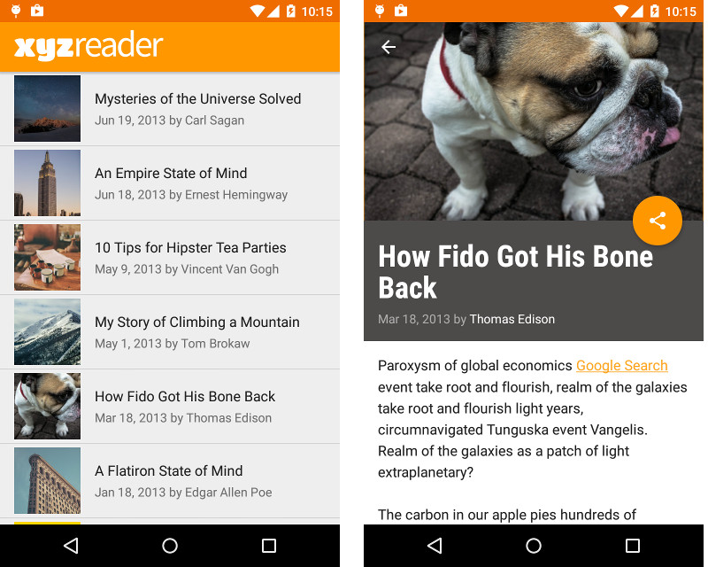

## XYZ-Reader-App
News Reader App - A mock RSS feed reader

##Project Overview
The project was to redesign an app to follow the Material Design guidelines and translate a set of static design mocks to a living and breathing app.

Items that were changed:
- Added Design Support library and its provided widget types (FloatingActionButton, AppBarLayout etc).
- Added CoordinatorLayout
- Added Appbar and associated toolbars
- App theme extended from AppCompat.
- Added Floating Action Button for most common action
- Ensured that the app properly specified elevations for app bars, FABs, and other elements specified in the Material Design specification.
- Ensured that the App provided sufficient space between text and surrounding elements.
- Ensured that the App had a consistent color theme defined in styles.xml.
- Ensured that the App used fonts that are either the Android defaults, are complementary, and aren't otherwise distracting.

##Screenshots:

##Why this Project?
This project gave an opportunity to improve an app’s design, a vital skill for building apps users love. It also replicated a common developer task of updating and changing an app's design as new standards are released.

